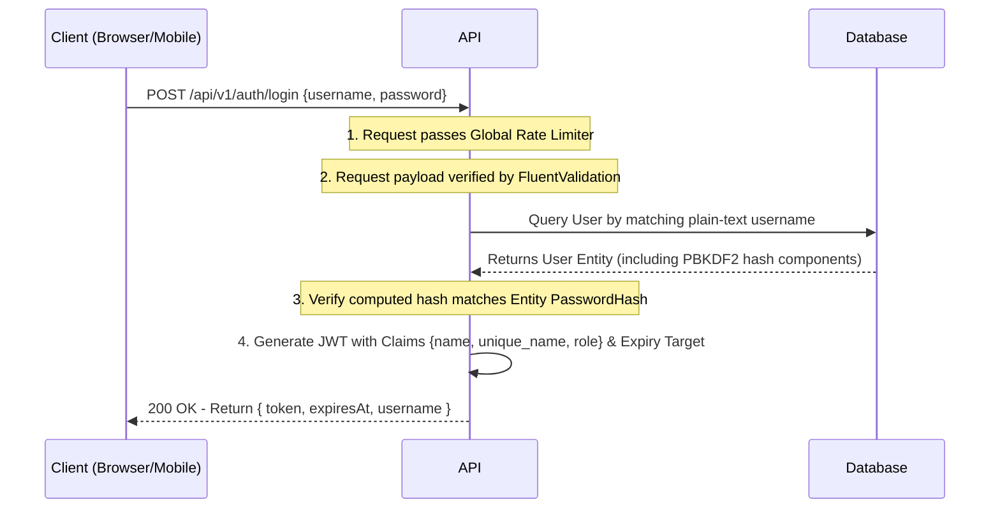
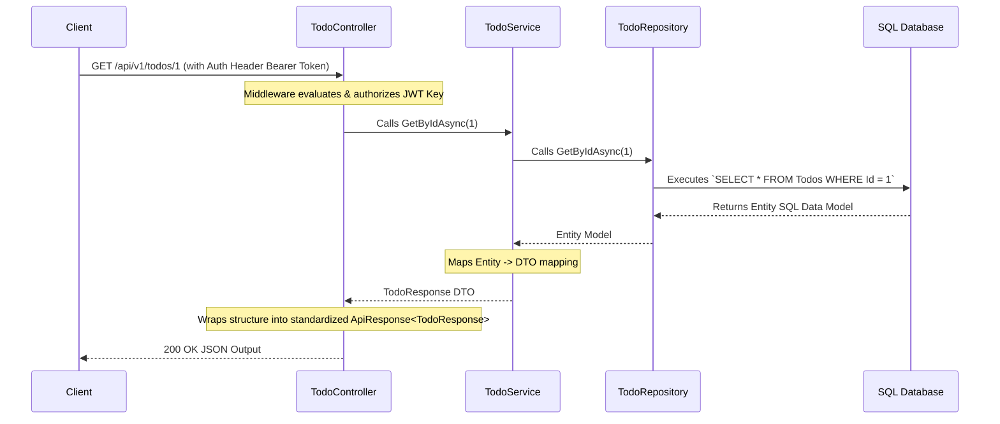
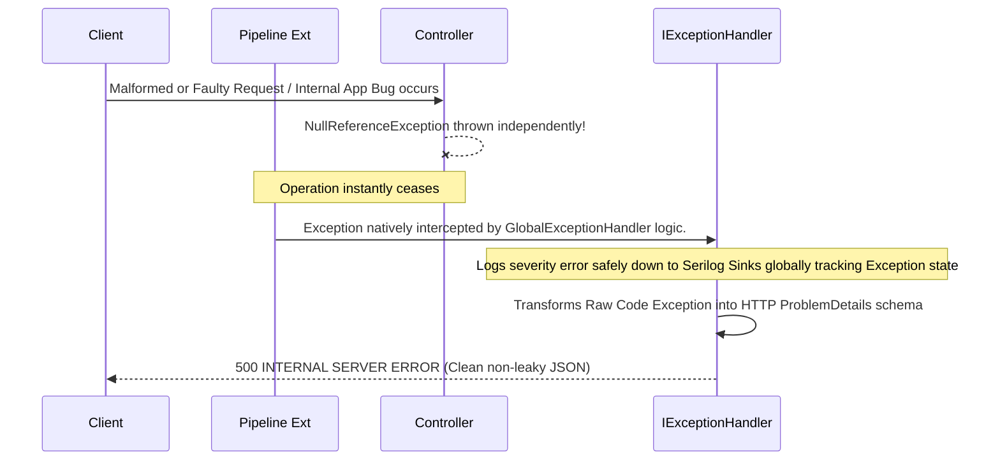

# 🔄 System Interaction Flows

This document visualizes how data requests traverse the API to clarify expected behaviors for external integration, troubleshooting, and debugging.

---

## 🔑 Authentication & Login Flow

## ✅ CRUD Execution Flow (Standard Operations)

## 💥 Global Exception Pipeline Mechanism Flow

